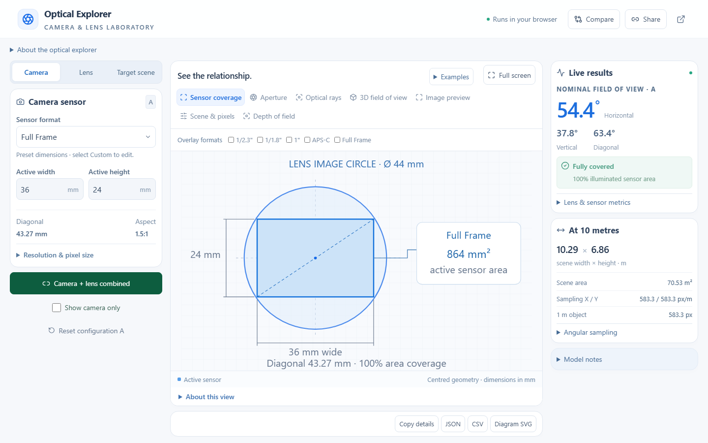
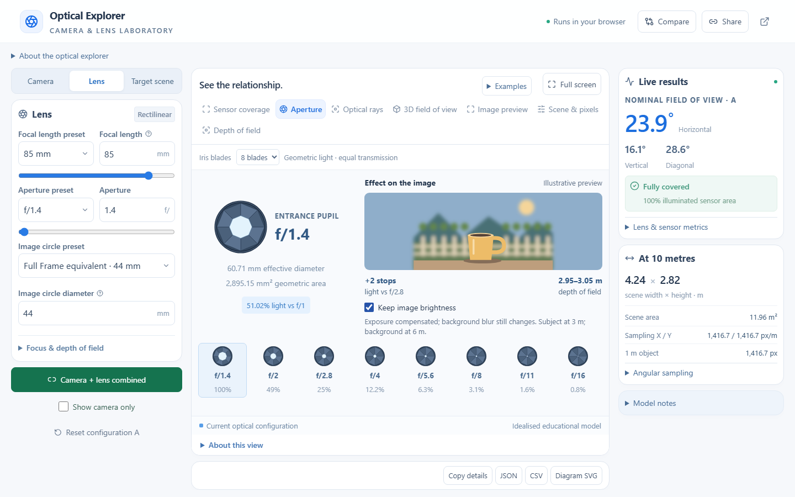
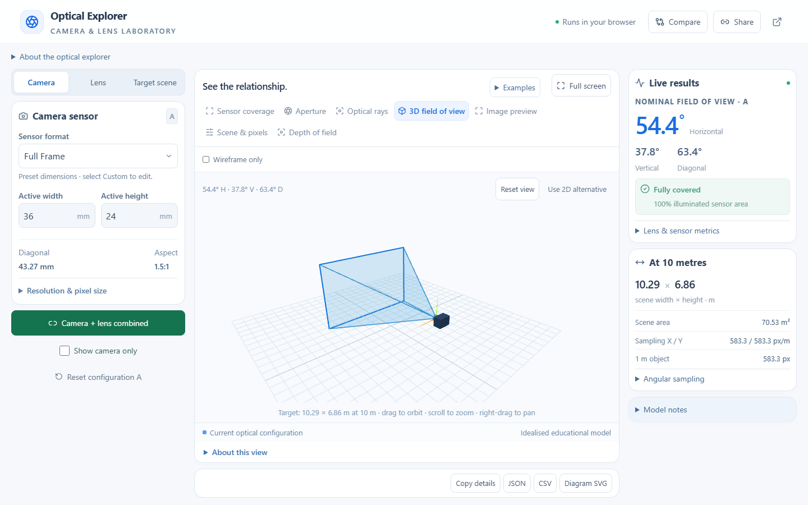

# Camera & Lens Optical Explorer

Explore how sensor size, focal length and aperture affect field of view, lens coverage, brightness and depth of field. Adjust settings live and compare two camera-and-lens configurations.

[Open the camera & lens explorer](https://maninka123.github.io/Interactive-Camera-FOV-Simulator/camera-lens-explorer/) · [Feature overview and usage guide](https://maninka123.github.io/Interactive-Camera-FOV-Simulator/#guide)

## See it in action

**Sensor coverage and live results** — compare the sensor's dimensions with the lens image circle.



**Aperture and image effects** — see the opening alongside changes in brightness and background blur.



**Interactive 3D field of view** — orbit, pan and zoom around the camera's viewing volume.



## Run locally

Use Node.js 22 or newer. From this app’s folder (or the root of its standalone clone):

```sh
npm ci
npm run dev
```

Open the URL printed by Vite.

## Verify and build

```sh
npm run typecheck
npm test
npx playwright install chromium
npm run test:browser
npm run build
```

The calculation tests cover reference values, units, exact coverage geometry, optical invariants, pixel sampling, depth of field, input validation and sharing. Browser tests exercise all views, independent comparison, downloads, keyboard navigation and phone/tablet layouts. Three.js loads only when its tab is active.

See [equations, preset sources and limitations](docs/optical-models.md) for the calculation models.
